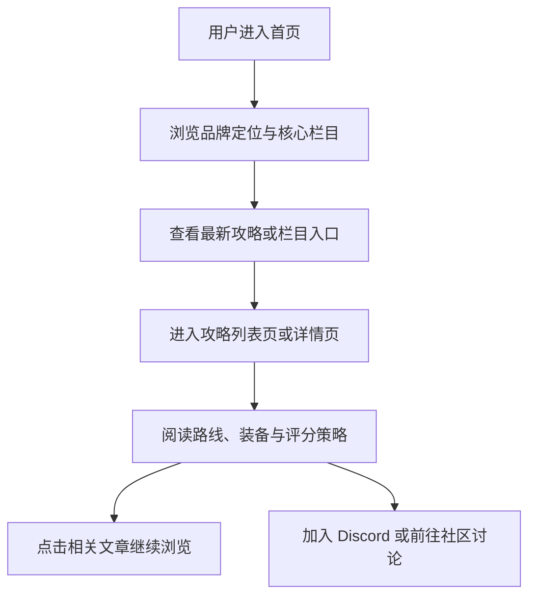

## 1. 产品概述

这是一个面向《007: First Light》硬核玩家的非官方深度攻略站，核心价值不是“教你怎么过关”，而是“教你怎么以更高评分、更优路线、更强策略完成关卡与模式挑战”。

- 主要解决通用攻略站内容偏浅、缺少 S-Rank 路线、装备组合和 TacSim 冲榜策略的问题
- 面向追求潜行效率、评分优化、全收集与全成就的中重度玩家，建立差异化内容品牌与社区讨论入口

## 2. 核心功能

### 2.1 功能模块

1. **首页**：品牌定位、核心栏目入口、最新攻略聚合、游戏基础信息、Discord 引流
2. **攻略列表页**：展示全部核心文章，支持按栏目理解内容范围
3. **栏目聚合页**：按 `Gadgets`、`Missions`、`TacSim` 聚合相关文章
4. **攻略详情页**：统一长文模板，承载摘要、正文分节、提示框、相关攻略和社区引流
5. **关于页**：说明站点定位、非官方声明、内容方法论与社区入口

### 2.2 页面详情

| 页面名称 | 模块名称 | 功能说明 |
|-----------|-------------|---------------------|
| 首页 | Hero 区域 | 突出品牌口号、价值主张与主 CTA，建立高端特工档案风格的第一印象 |
| 首页 | 核心内容板块 | 展示 New Agent Briefing、Mission Walkthroughs、Gadgets & Loadouts、Tactical Simulation 四个核心方向 |
| 首页 | 最新攻略 | 横向滚动或卡片式展示 3 至 5 篇首批精选文章，含标题、简介、阅读时间、分类标签 |
| 首页 | 游戏信息区 | 展示发行时间、开发商、平台、游戏时长、主线任务数等关键资料 |
| 首页 | 社区转化区 | 在页面底部加入 Discord 邀请和 Reddit 讨论引导 |
| Guides 页面 | 文章列表 | 展示全部首批内容，支持快速浏览标题、摘要、标签与入口 |
| Gadgets 页面 | 分类聚合 | 聚合装备与负载搭配相关文章 |
| Missions 页面 | 分类聚合 | 聚合任务攻略与路线拆解相关文章 |
| TacSim 页面 | 分类聚合 | 聚合战术模拟模式相关文章 |
| About 页面 | 站点说明 | 介绍站点定位、目标用户、内容来源与非官方声明 |
| 详情页 | 标题与摘要 | 展示文章标题、1 至 2 句摘要、阅读时间与分类标签 |
| 详情页 | 正文内容 | 使用 h2/h3 分节，支持提示框、重点引用、要点列表与 FAQ |
| 详情页 | 相关攻略 | 展示相关文章，增强站内跳转与 SEO 内链 |
| 详情页 | 引流模块 | 加入 Discord 邀请和社区讨论引导 |

## 3. 核心流程

用户首先通过首页进入站点，感知“高分策略攻略站”的定位，然后从首页核心栏目或最新文章进入具体攻略；在文章页获取路线、装备搭配和模式策略后，再通过相关攻略与底部社区模块继续浏览和参与讨论。

## 4. 用户界面设计

### 4.1 设计风格

- 主色：深蓝黑 `#0a0d14`
- 强调色：金色 `#d4a843`
- 辅助色：白色 `#e8e8e8`、暗金 `#8b7335`
- 按钮风格：扁平高质感按钮，细边框、金色描边、悬停带发光和位移动效
- 字体策略：正文使用现代无衬线，标题使用高端 serif 字体，营造 MI6 档案感
- 布局风格：桌面优先、大留白、卡片式分区、顶部导航、细线框与情报面板风格容器
- 图标建议：使用简洁线性图标，避免卡通化和夸张表情化元素

### 4.2 页面设计概览

| 页面名称 | 模块名称 | UI 元素 |
|-----------|-------------|-------------|
| 首页 | Hero 区域 | 深色背景、金色线条、情报档案感标题排版、主按钮、次级说明文本 |
| 首页 | 核心板块 | 四列卡片、细边框、悬停高亮、分类标识 |
| 首页 | 最新攻略 | 横向卡片列表、阅读时间标签、分类标签、简介文本 |
| 首页 | 游戏信息区 | 情报卡面板、参数列表、双列布局 |
| Guides 页面 | 文章列表 | 多列攻略卡片、分类标签、简介与阅读时间 |
| 详情页 | 正文 | 大标题、摘要引用块、章节标题、策略提示框、重点操作引用框 |
| About 页面 | 说明模块 | 品牌介绍、内容原则、免责声明、社区入口 |

### 4.3 响应式策略

- 采用桌面优先设计
- 平板端将多列卡片压缩为双列
- 移动端导航折叠为简化布局，内容区转为单列阅读
- 保证按钮可点击区域、卡片间距和长文可读性
- 对横向卡片区提供触控滚动体验

## 5. 首版内容范围

首版需要至少覆盖以下 7 篇文章，并作为站内首批可浏览内容：

1. `New Agent Briefing`
2. `Stealth vs Combat Decision Guide`
3. `All Gadgets Guide`
4. `Mission 1 Walkthrough`
5. `Best Loadout for Beginners`
6. `TacSim Mode Guide`
7. `Common Beginner Mistakes`

## 6. 内容与 SEO 要求

- 文章标题遵循 `"[关键词] — 007 First Light Guide"` 格式
- 每篇文章目标长度不少于 800 词
- 使用清晰的 h2/h3 结构组织正文
- 为每篇文章提供 `meta description`
- 建立文章间相关链接，增强内链结构
- 输出 `Game` 与 `FAQPage` 等结构化数据
- 首页与文章页都要设置社区引流入口

## 7. 非功能要求

- 技术栈固定为 `Next.js + TailwindCSS`
- 项目需可部署到 `Vercel`
- 首版以静态内容优先，保证快速上线与稳定访问
- 全站完全响应式
- 保持高端、冷静、专业的视觉表达，避免通用博客模板感
