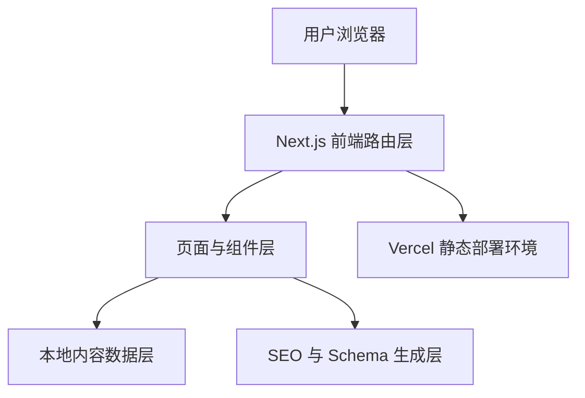
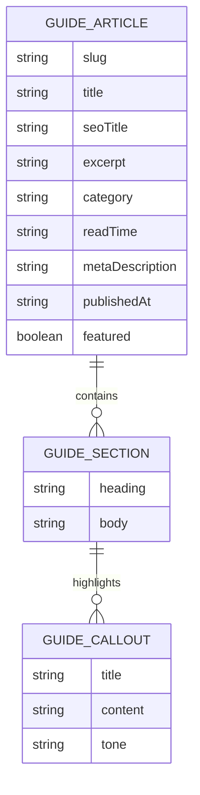

## 1. 架构设计

首版采用纯前端静态内容架构，以 `Next.js App Router` 负责页面路由、元信息和静态生成，以本地结构化数据文件管理攻略内容与站点信息，不引入数据库或外部 CMS，优先保证部署简单、内容一致与性能稳定。



## 2. 技术说明

- 前端框架：`Next.js`（App Router） + `React` + `TypeScript`
- 样式方案：`TailwindCSS`
- 部署平台：`Vercel`
- 内容来源：项目内 `data` 目录的结构化静态数据
- SEO 能力：`Next.js Metadata`、`sitemap`、`robots`、`JSON-LD`
- 包管理：优先使用 `npm`

## 3. 路由定义

| 路由 | 用途 |
|-------|---------|
| `/` | 首页，展示品牌定位、核心内容板块、最新文章、游戏信息与社区入口 |
| `/guides` | 全部攻略列表页 |
| `/guides/[slug]` | 攻略详情页 |
| `/gadgets` | 装备与搭配栏目页 |
| `/missions` | 任务与路线栏目页 |
| `/tacsim` | TacSim 模式栏目页 |
| `/about` | 关于本站与免责声明页面 |

## 4. API 定义

首版不引入后端 API。页面全部基于本地内容与静态渲染完成，因此无需控制器、服务层或数据库接口。

## 5. 数据模型

### 5.1 数据模型定义



### 5.2 TypeScript 数据定义

```ts
export type GuideCategory =
  | "briefing"
  | "guides"
  | "gadgets"
  | "missions"
  | "tacsim";

export interface GuideCallout {
  title: string;
  content: string;
  tone: "info" | "warning" | "success";
}

export interface GuideSection {
  heading: string;
  body: string[];
  tips?: string[];
  callouts?: GuideCallout[];
  quote?: string;
}

export interface GuideFaq {
  question: string;
  answer: string;
}

export interface GuideArticle {
  slug: string;
  title: string;
  seoTitle: string;
  excerpt: string;
  category: GuideCategory;
  readTime: string;
  metaDescription: string;
  keywords: string[];
  publishedAt: string;
  featured: boolean;
  sections: GuideSection[];
  faq?: GuideFaq[];
  relatedSlugs: string[];
}
```

## 6. 目录结构规划

```text
app/
  layout.tsx
  page.tsx
  guides/
    page.tsx
    [slug]/page.tsx
  gadgets/page.tsx
  missions/page.tsx
  tacsim/page.tsx
  about/page.tsx
  sitemap.ts
  robots.ts
components/
  home/
  layout/
  ui/
data/
  guides.ts
  navigation.ts
  site-meta.ts
lib/
  guides.ts
  schema.ts
  seo.ts
```

## 7. 关键实现约束

- 页面与数据解耦，页面只消费 `lib` 中的查询结果
- 首页、栏目页、详情页统一使用可复用卡片组件与节标题组件
- 文章内容以结构化数据渲染，不在页面文件中硬编码大段正文
- 所有元信息统一通过 `lib/seo.ts` 生成，避免页面间重复逻辑
- 文章页根据内容动态生成 `FAQPage` Schema；首页生成 `Game` Schema
- `slug` 未匹配时走 `notFound()`，保证路由行为明确

## 8. 样式系统策略

- 在 `app/globals.css` 中定义 CSS 变量、背景纹理、卡片边框、光泽效果和阅读排版
- 通过 Tailwind 的扩展色值与阴影配置统一深色特工风格
- 使用顶部导航和页脚作为全站稳定框架
- 保证文章页长文行宽、段落间距、引用块与提示框具备高可读性

## 9. SEO 与内容发现

- 使用 `generateMetadata` 为首页、列表页、详情页输出标题与描述
- 生成 `sitemap.ts` 和 `robots.ts`
- 详情页输出文章相关链接，首页输出精选文章入口
- 通过 `keywords`、`excerpt`、`faq` 提升页面语义完整度

## 10. 验证与部署

- 本地执行类型检查与构建检查
- 检查新增页面无 TypeScript 与样式诊断问题
- 本地预览桌面端与移动端关键页面
- 完成后可直接部署到 `Vercel`
